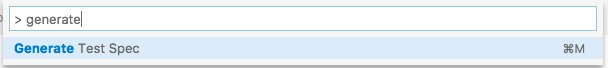

# Test Spec Generator

This extension will help you to generate test specs from an object or an array. Now supports `jasmine`, `chai` and `should` formats.

## Usage

Select an object or an array in a text editor and press `CTRL + M` / `CMD(⌘) + M` or press `CMD+Shift+P` and search for `Generate Test Spec`



## Example

Select the following object and run the command.

### Source

```ts
{
  status: 'deleted',
  item: {
    name: 'Sample User',
    userId: 'sample1@user.com',
    active: true,
    roles: []
  }
}
```
### Output

Note: Update `specGenerator.style` to select the style

### **chai** style

```ts
expect(result).be.a("object");
expect(result).have.property("status");
expect(result.status).be.equal("deleted");

expect(result).have.property("item");
expect(result.item).be.a("object");
expect(result.item).have.property("name");
expect(result.item.name).be.equal("Sample User");

expect(result.item).have.property("userId");
expect(result.item.userId).be.equal("sample1@user.com");

expect(result.item).have.property("active");
expect(result.item.active).be.equal(true);

expect(result.item).have.property("roles");
expect(result.item.roles).be.a("array");
expect(result.item.roles).be.empty;
```

### **should** style
```ts
result.should.be.a("object");
result.should.have.property("status");
result.status.should.be.equal("deleted");

result.should.have.property("item");
result.item.should.be.a("object");
result.item.should.have.property("name");
result.item.name.should.be.equal("Sample User");

result.item.should.have.property("userId");
result.item.userId.should.be.equal("sample1@user.com");

result.item.should.have.property("active");
result.item.active.should.be.equal(true);

result.item.should.have.property("roles");
result.item.roles.should.be.a("array");
result.item.roles.should.be.empty;
```

### **jasmine** style
```ts
expect(typeof result === "object" && !(result instanceof Array)).toBeTruthy();
expect(Object.keys(result)).toContain("status");
expect(result.status).toEqual("deleted");

expect(Object.keys(result)).toContain("item");
expect(typeof result.item === "object" && !(result.item instanceof Array)).toBeTruthy();
expect(Object.keys(result.item)).toContain("name");
expect(result.item.name).toEqual("Sample User");

expect(Object.keys(result.item)).toContain("userId");
expect(result.item.userId).toEqual("sample1@user.com");

expect(Object.keys(result.item)).toContain("active");
expect(result.item.active).toBe(true);

expect(Object.keys(result.item)).toContain("roles");
expect(result.item.roles instanceof Array).toBeTruthy();
expect(result.item.roles.length).toEqual(0);
```

## Configuration

| Configuration                   | Type      | Valid Values                       | Default Value | Description
| ------------------------------- | --------- | ---------------------------------- | ------------- | -----------------------------
| specGenerator.style             | `string`  | `jasmine`, `chai`, `should`        | `chai`        | Change spec style to 'jasmine', 'chai' or 'should'.
| specGenerator.doubleQuote       | `boolean` | `true`, `false`                    | `false`       | Set to true for double quotes instead of single quotes.
| specGenerator.semicolon         | `boolean` | `true`, `false`                    | `true`        | Set to true for adding semicolon at the end of each line
| specGenerator.es6               | `boolean` | `true`, `false`                    | `true`        | Set to true to use es6 style where ever applicable.
| specGenerator.variableName      | `string`  | any string value                   | `result`      | Default variable name for generating spec. Eg: 'expect(result).to.exist;'

# Key Binding

Default key binding is as follows; Open `Code` >> `Preferences` >> `Keyboard Shortcuts` to edit this.

```json
{
  "command": "specGenerator.generate",
  "key": "ctrl+m",
  "mac": "cmd+m"
}
```

## Contributing

Contributions are welcome! Just send a pull request. Feel free to contact me or checkout my [Github](https://github.com/rintoj/chai-spec-generator) page.

## Author

**Rinto Jose** (rintoj)

Follow me:
  [Github](https://github.com/rintoj)
| [Facebook](https://www.facebook.com/rinto.jose)
| [Twitter](https://twitter.com/rintoj)
| [Google+](https://plus.google.com/+RintoJoseMankudy)
| [Youtube](https://youtube.com/+RintoJoseMankudy)

## License

```
The MIT License (MIT)

Copyright (c) 2016 Rinto Jose (rintoj)

Permission is hereby granted, free of charge, to any person obtaining a copy
of this software and associated documentation files (the "Software"), to deal
in the Software without restriction, including without limitation the rights
to use, copy, modify, merge, publish, distribute, sublicense, and/or sell
copies of the Software, and to permit persons to whom the Software is
furnished to do so, subject to the following conditions:

The above copyright notice and this permission notice shall be included in
all copies or substantial portions of the Software.

THE SOFTWARE IS PROVIDED "AS IS", WITHOUT WARRANTY OF ANY KIND, EXPRESS OR
IMPLIED, INCLUDING BUT NOT LIMITED TO THE WARRANTIES OF MERCHANTABILITY,
FITNESS FOR A PARTICULAR PURPOSE AND NONINFRINGEMENT. IN NO EVENT SHALL THE
AUTHORS OR COPYRIGHT HOLDERS BE LIABLE FOR ANY CLAIM, DAMAGES OR OTHER
LIABILITY, WHETHER IN AN ACTION OF CONTRACT, TORT OR OTHERWISE, ARISING FROM,
OUT OF OR IN CONNECTION WITH THE SOFTWARE OR THE USE OR OTHER DEALINGS IN
THE SOFTWARE.
```

**Enjoy!**
